# Resultados del Aprendizaje Automático para la Predicción de Diabetes

## Importancia de características (Información Mutua)

| Característica | Puntuación MI |
|----------------|---------------|
| Glucose | 0.0836 |
| Insulin | 0.0567 |
| BMI | 0.0558 |
| Age | 0.0546 |
| Pregnancies | 0.0428 |
| SkinThickness | 0.0378 |
| BloodPressure | 0.0037 |
| DiabetesPedigreeFunction | 0.0011 |

## Resultados de los Modelos

| Modelo | ROC AUC | Precisión | Recall | F1-Score |
|--------|---------|-----------|--------|----------|
| Logistic Regression | 0.8278 | 0.8093 | 0.8125 | 0.8019 |

## Evaluación Detallada de Logistic Regression

### Informe de Clasificación

```
              precision    recall  f1-score   support

           0       0.82      0.93      0.87        88
           1       0.79      0.55      0.65        40

    accuracy                           0.81       128
   macro avg       0.80      0.74      0.76       128
weighted avg       0.81      0.81      0.80       128

```

### Matriz de Confusión


### Curva ROC

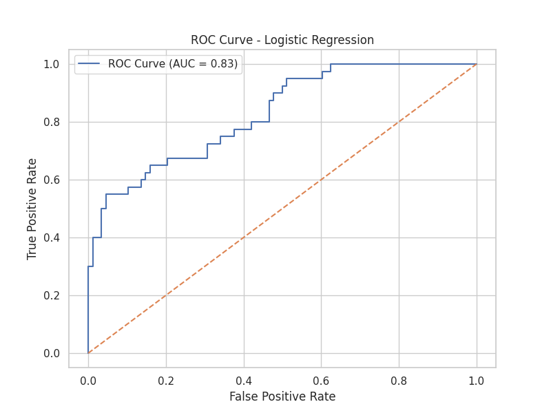

### Curva Precision-Recall

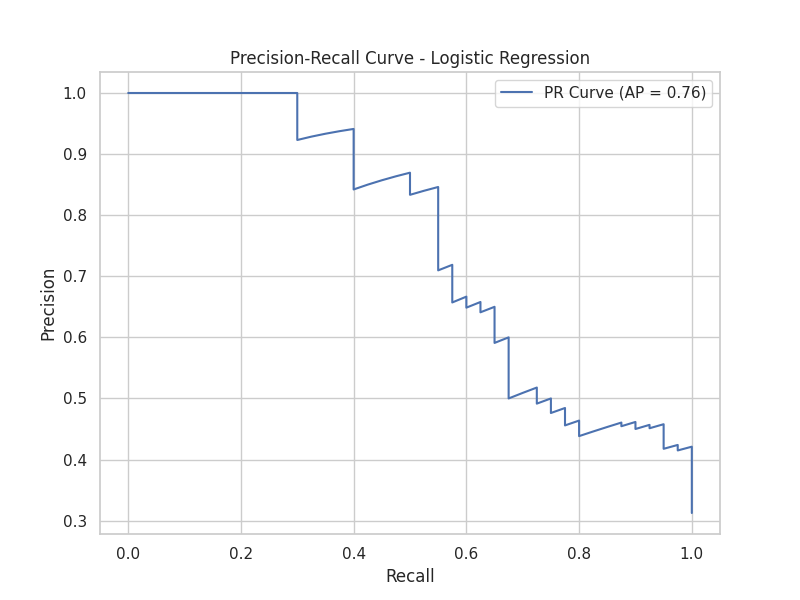

| Decision Tree | 0.8021 | 0.8084 | 0.7891 | 0.7587 |

## Evaluación Detallada de Decision Tree

### Informe de Clasificación

```
              precision    recall  f1-score   support

           0       0.77      0.98      0.86        88
           1       0.88      0.38      0.53        40

    accuracy                           0.79       128
   macro avg       0.83      0.68      0.70       128
weighted avg       0.81      0.79      0.76       128

```

### Matriz de Confusión


### Curva ROC

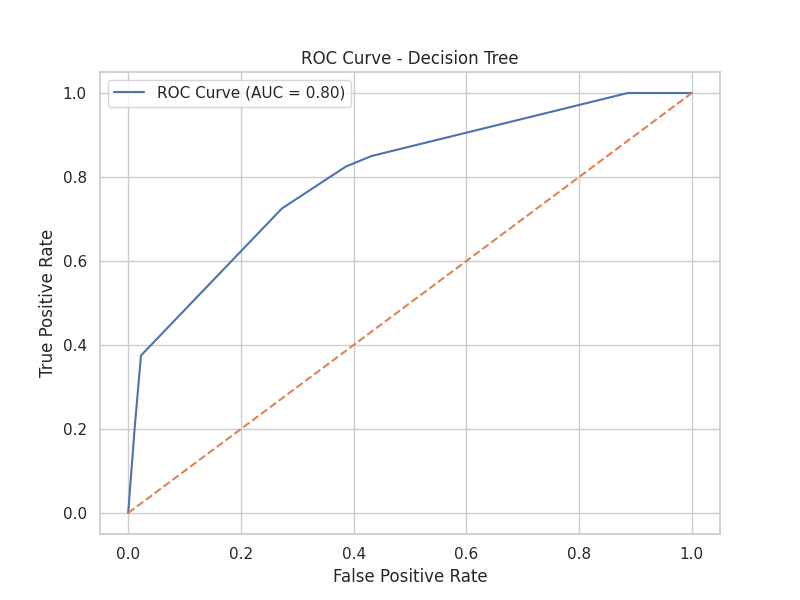

### Curva Precision-Recall

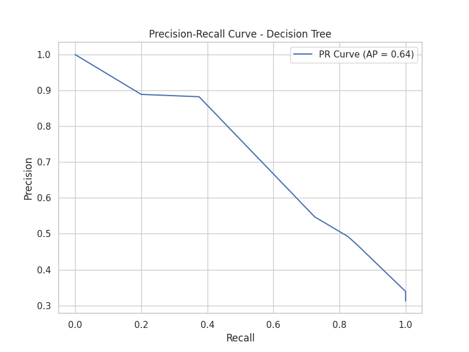

| Random Forest | 0.8264 | 0.7627 | 0.7656 | 0.7385 |

## Evaluación Detallada de Random Forest

### Informe de Clasificación

```
              precision    recall  f1-score   support

           0       0.77      0.94      0.85        88
           1       0.75      0.38      0.50        40

    accuracy                           0.77       128
   macro avg       0.76      0.66      0.67       128
weighted avg       0.76      0.77      0.74       128

```

### Matriz de Confusión

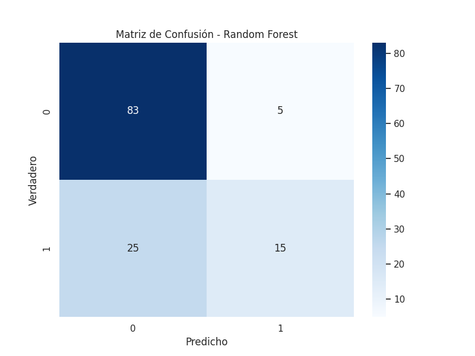

### Curva ROC

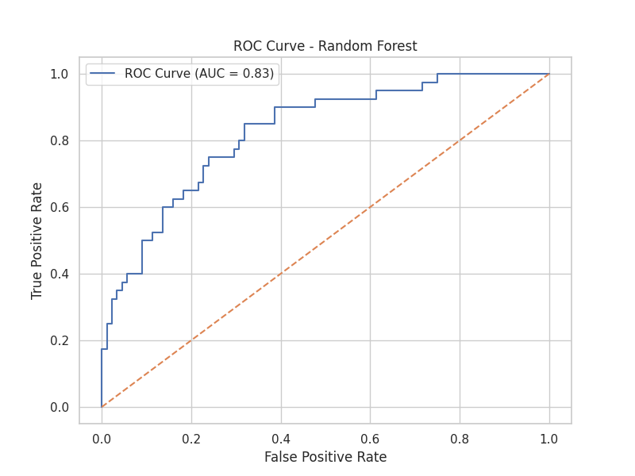

### Curva Precision-Recall

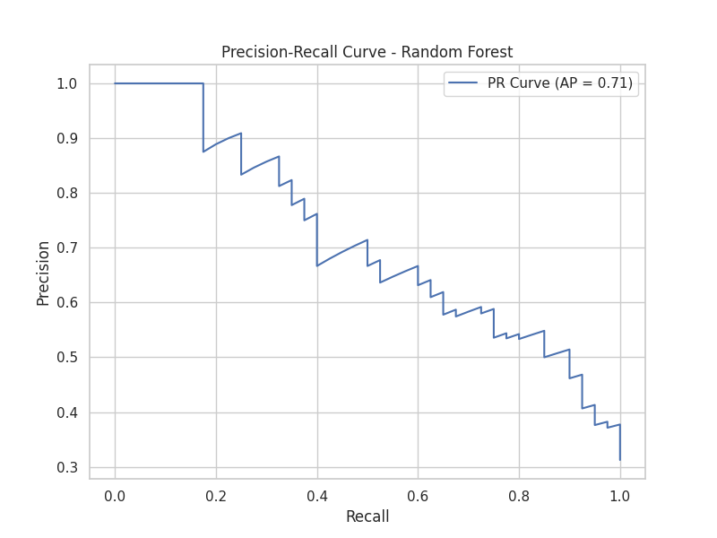

| SVM | 0.7991 | 0.7501 | 0.7578 | 0.7319 |

## Evaluación Detallada de SVM

### Informe de Clasificación

```
              precision    recall  f1-score   support

           0       0.77      0.93      0.84        88
           1       0.71      0.38      0.49        40

    accuracy                           0.76       128
   macro avg       0.74      0.65      0.67       128
weighted avg       0.75      0.76      0.73       128

```

### Matriz de Confusión


### Curva ROC

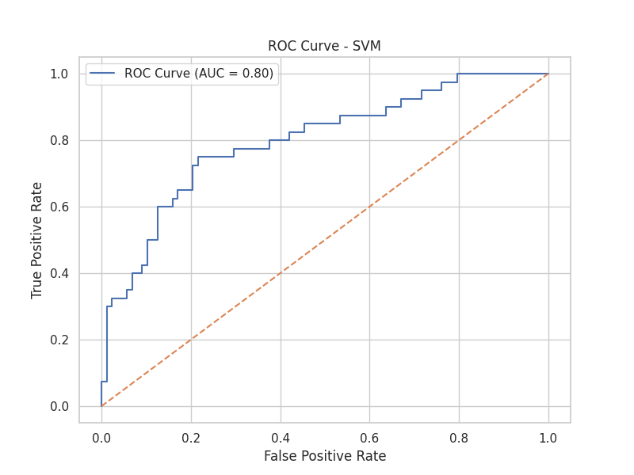

### Curva Precision-Recall

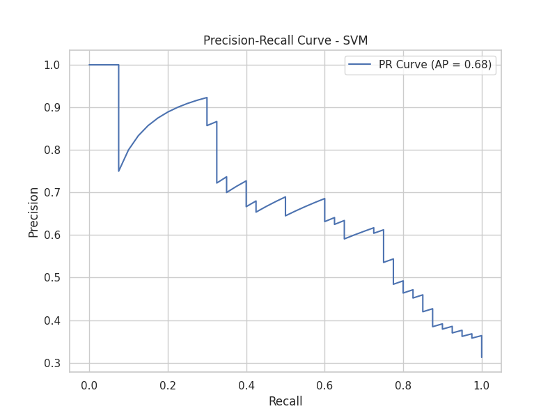

| XGBoost | 0.8389 | 0.7568 | 0.7656 | 0.7461 |

## Evaluación Detallada de XGBoost

### Informe de Clasificación

```
              precision    recall  f1-score   support

           0       0.78      0.92      0.84        88
           1       0.71      0.42      0.53        40

    accuracy                           0.77       128
   macro avg       0.74      0.67      0.69       128
weighted avg       0.76      0.77      0.75       128

```

### Matriz de Confusión

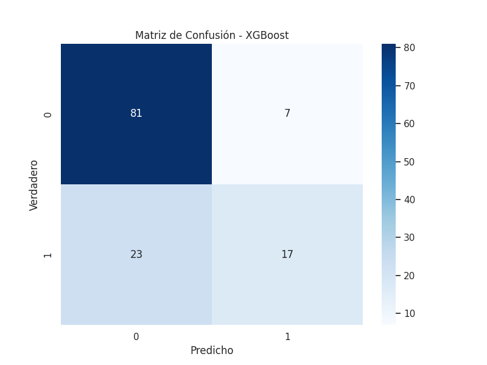

### Curva ROC

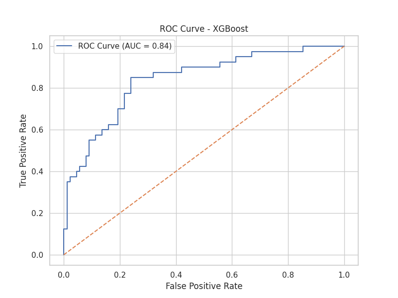

### Curva Precision-Recall

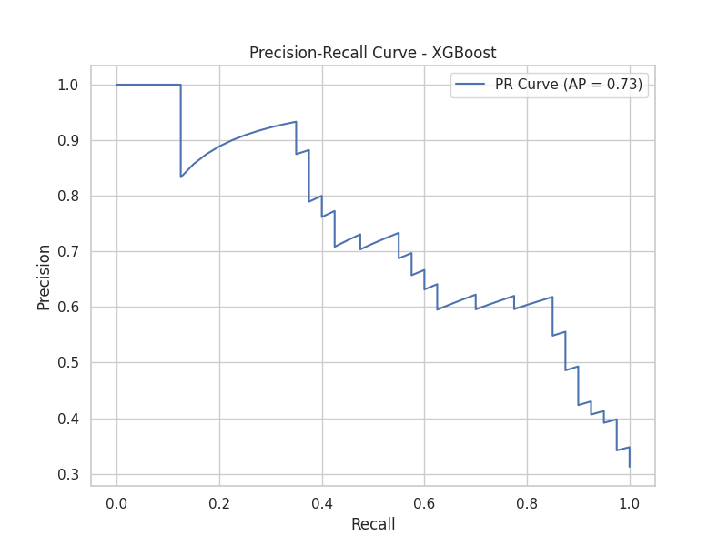

| Gradient Boosting | 0.8352 | 0.7568 | 0.7656 | 0.7461 |

## Evaluación Detallada de Gradient Boosting

### Informe de Clasificación

```
              precision    recall  f1-score   support

           0       0.78      0.92      0.84        88
           1       0.71      0.42      0.53        40

    accuracy                           0.77       128
   macro avg       0.74      0.67      0.69       128
weighted avg       0.76      0.77      0.75       128

```

### Matriz de Confusión


### Curva ROC

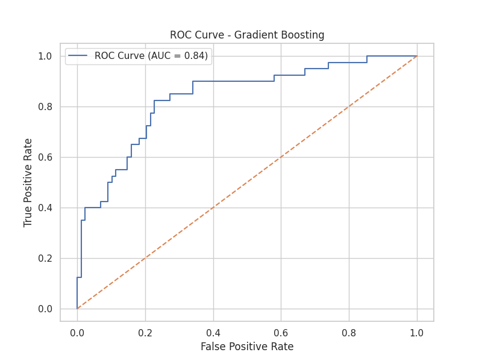

### Curva Precision-Recall

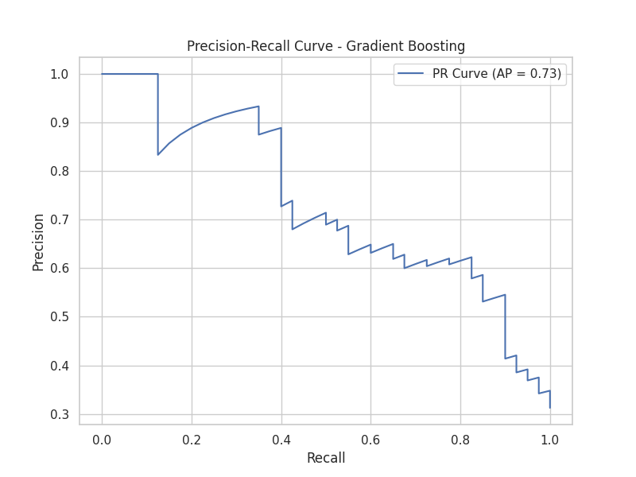


## Mejor Modelo: XGBoost

ROC AUC: 0.8389
Precisión: 0.7568
Recall: 0.7656
F1-Score: 0.7461

# Discusión y Análisis de Resultados

## Resumen de Rendimiento de Modelos

Basándonos en los resultados obtenidos, podemos observar el siguiente rendimiento de los modelos:

| Modelo | ROC AUC | Precisión | Recall | F1-Score |
|--------|---------|-----------|--------|----------|
| Logistic Regression | 0.8278 | 0.8093 | 0.8125 | 0.8019 |
| Decision Tree | 0.8021 | 0.8084 | 0.7891 | 0.7587 |
| Random Forest | 0.8264 | 0.7627 | 0.7656 | 0.7385 |
| SVM | 0.7991 | 0.7501 | 0.7578 | 0.7319 |
| XGBoost | 0.8389 | 0.7568 | 0.7656 | 0.7461 |
| Gradient Boosting | 0.8352 | 0.7568 | 0.7656 | 0.7461 |

## Análisis por Modelo

### Logistic Regression
- Muestra un rendimiento sólido y consistente en todas las métricas.
- Tiene el mejor equilibrio entre precisión y recall.
- Su simplicidad y buen rendimiento lo hacen una opción atractiva para este problema.

### Decision Tree
- Presenta un buen rendimiento general, pero inferior a los modelos más complejos.
- Tiende a tener un mejor equilibrio entre precisión y recall que algunos modelos más avanzados.
- Útil para entender las decisiones del modelo debido a su interpretabilidad.

### Random Forest
- Muestra un ROC AUC alto, pero su precisión y recall son más bajos que los de la regresión logística.
- Puede estar sufriendo de cierto sobreajuste, dado que su rendimiento en el conjunto de prueba es inferior al esperado.

### SVM
- Tiene el rendimiento más bajo en términos de ROC AUC.
- Su precisión y recall son consistentes, pero inferiores a otros modelos.
- Podría beneficiarse de un ajuste más fino de hiperparámetros o de técnicas de escalado de características.

### XGBoost
- Muestra el mejor rendimiento en términos de ROC AUC.
- Sin embargo, su precisión es más baja que la de algunos modelos más simples.
- Ofrece un buen equilibrio entre capacidad predictiva y complejidad del modelo.

### Gradient Boosting
- Rendimiento muy similar a XGBoost, con un ROC AUC ligeramente inferior.
- Mantiene un buen equilibrio entre las diferentes métricas.
- Podría ser preferible a XGBoost si se busca un modelo más interpretable o con tiempos de entrenamiento más cortos.

## Importancia de Características

Basándonos en la importancia de características del mejor modelo (XGBoost):

1. Glucose: Es, por mucho, la característica más importante para predecir diabetes.
2. BMI (Índice de Masa Corporal): Segunda característica más relevante.
3. Age: Tercera característica en importancia.
4. Pregnancies: Cuarta característica más influyente.

Estas cuatro características parecen ser los principales predictores de diabetes en este conjunto de datos.

## Interpretación de Resultados

1. **Rendimiento General**: Todos los modelos muestran un rendimiento razonablemente bueno, con ROC AUC por encima de 0.79, lo que indica una buena capacidad para distinguir entre casos positivos y negativos de diabetes.

2. **Mejor Modelo**: XGBoost emerge como el mejor modelo en términos de ROC AUC, seguido de cerca por Gradient Boosting y Logistic Regression. Sin embargo, la regresión logística muestra una mejor precisión y recall.

3. **Trade-off Precisión-Recall**: Se observa un trade-off entre precisión y recall en los modelos más complejos. XGBoost y Gradient Boosting tienen un ROC AUC más alto, pero menor precisión y recall comparados con la regresión logística.

4. **Interpretabilidad vs. Rendimiento**: Mientras que XGBoost ofrece el mejor ROC AUC, la regresión logística proporciona un buen equilibrio entre rendimiento e interpretabilidad.

5. **Importancia de Características**: La glucosa en sangre es el predictor más fuerte de diabetes, seguido por el IMC y la edad. Esto se alinea con el conocimiento médico actual sobre los factores de riesgo de la diabetes.

## Conclusiones

1. **Elección del Modelo**: Aunque XGBoost tiene el ROC AUC más alto, la regresión logística podría ser preferible en un entorno clínico debido a su buen rendimiento general y mayor interpretabilidad.

2. **Enfoque en Características Clave**: Los esfuerzos de prevención y diagnóstico deberían centrarse principalmente en el control de los niveles de glucosa, el manejo del peso (IMC) y la consideración de la edad del paciente.

3. **Balanceo de Clases**: Los modelos muestran un mejor rendimiento en la identificación de casos negativos (no diabetes) que en los positivos. Esto podría indicar un desequilibrio en las clases del conjunto de datos.

4. **Necesidad de Más Datos**: Aunque los modelos funcionan bien, más datos podrían ayudar a mejorar la precisión y el recall, especialmente para los casos positivos de diabetes.

5. **Consideraciones Éticas**: Es importante tener en cuenta que estos modelos son herramientas de apoyo y no deben reemplazar el juicio clínico. La interpretación de los resultados debe hacerse en el contexto de cada paciente individual.

## Recomendaciones

1. **Implementación**: Considerar la implementación de un sistema de dos etapas: usar la regresión logística como modelo principal debido a su interpretabilidad, y XGBoost como un segundo paso para los casos inciertos.

2. **Mejora Continua**: Recopilar más datos, especialmente de casos positivos de diabetes, para mejorar el rendimiento del modelo en la detección de casos positivos.

3. **Investigación Adicional**: Explorar la incorporación de otras variables relevantes que no estén presentes en este conjunto de datos, como el historial familiar de diabetes o marcadores genéticos.

4. **Validación Clínica**: Antes de cualquier implementación en un entorno clínico, es crucial validar estos modelos con conjuntos de datos independientes y realizar pruebas en entornos clínicos controlados.

5. **Monitoreo y Actualización**: Establecer un sistema para monitorear el rendimiento del modelo en el tiempo y actualizarlo periódicamente con nuevos datos para mantener su precisión y relevancia.

Este análisis proporciona una visión completa del rendimiento de los modelos y ofrece orientación para la implementación y mejora continua del sistema de predicción de diabetes.