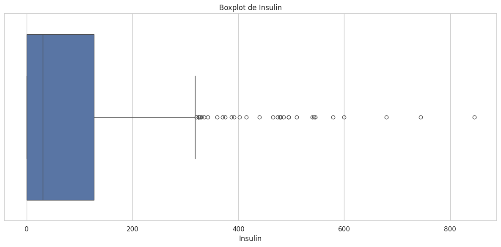

### Cargamos el DATASET

### EDA

    Dataset cargado exitosamente.
    
    Información general del dataset:
    <class 'pandas.core.frame.DataFrame'>
    RangeIndex: 768 entries, 0 to 767
    Data columns (total 9 columns):
     #   Column                    Non-Null Count  Dtype  
    ---  ------                    --------------  -----  
     0   Pregnancies               768 non-null    int64  
     1   Glucose                   768 non-null    int64  
     2   BloodPressure             768 non-null    int64  
     3   SkinThickness             768 non-null    int64  
     4   Insulin                   768 non-null    int64  
     5   BMI                       768 non-null    float64
     6   DiabetesPedigreeFunction  768 non-null    float64
     7   Age                       768 non-null    int64  
     8   Outcome                   768 non-null    int64  
    dtypes: float64(2), int64(7)
    memory usage: 54.1 KB
    
    
    Estadísticas descriptivas del dataset:

<table border="1" class="dataframe">
  <thead>
    <tr style="text-align: right;">
      <th></th>
      <th>count</th>
      <th>mean</th>
      <th>std</th>
      <th>min</th>
      <th>25%</th>
      <th>50%</th>
      <th>75%</th>
      <th>max</th>
    </tr>
  </thead>
  <tbody>
    <tr>
      <th>Pregnancies</th>
      <td>768.0</td>
      <td>3.845052</td>
      <td>3.369578</td>
      <td>0.000</td>
      <td>1.00000</td>
      <td>3.0000</td>
      <td>6.00000</td>
      <td>17.00</td>
    </tr>
    <tr>
      <th>Glucose</th>
      <td>768.0</td>
      <td>120.894531</td>
      <td>31.972618</td>
      <td>0.000</td>
      <td>99.00000</td>
      <td>117.0000</td>
      <td>140.25000</td>
      <td>199.00</td>
    </tr>
    <tr>
      <th>BloodPressure</th>
      <td>768.0</td>
      <td>69.105469</td>
      <td>19.355807</td>
      <td>0.000</td>
      <td>62.00000</td>
      <td>72.0000</td>
      <td>80.00000</td>
      <td>122.00</td>
    </tr>
    <tr>
      <th>SkinThickness</th>
      <td>768.0</td>
      <td>20.536458</td>
      <td>15.952218</td>
      <td>0.000</td>
      <td>0.00000</td>
      <td>23.0000</td>
      <td>32.00000</td>
      <td>99.00</td>
    </tr>
    <tr>
      <th>Insulin</th>
      <td>768.0</td>
      <td>79.799479</td>
      <td>115.244002</td>
      <td>0.000</td>
      <td>0.00000</td>
      <td>30.5000</td>
      <td>127.25000</td>
      <td>846.00</td>
    </tr>
    <tr>
      <th>BMI</th>
      <td>768.0</td>
      <td>31.992578</td>
      <td>7.884160</td>
      <td>0.000</td>
      <td>27.30000</td>
      <td>32.0000</td>
      <td>36.60000</td>
      <td>67.10</td>
    </tr>
    <tr>
      <th>DiabetesPedigreeFunction</th>
      <td>768.0</td>
      <td>0.471876</td>
      <td>0.331329</td>
      <td>0.078</td>
      <td>0.24375</td>
      <td>0.3725</td>
      <td>0.62625</td>
      <td>2.42</td>
    </tr>
    <tr>
      <th>Age</th>
      <td>768.0</td>
      <td>33.240885</td>
      <td>11.760232</td>
      <td>21.000</td>
      <td>24.00000</td>
      <td>29.0000</td>
      <td>41.00000</td>
      <td>81.00</td>
    </tr>
    <tr>
      <th>Outcome</th>
      <td>768.0</td>
      <td>0.348958</td>
      <td>0.476951</td>
      <td>0.000</td>
      <td>0.00000</td>
      <td>0.0000</td>
      <td>1.00000</td>
      <td>1.00</td>
    </tr>
  </tbody>
</table>

    El dataset no tiene valores faltantes.
    Distribución de clases en la variable objetivo:

    Outcome
    0    500
    1    268
    Name: count, dtype: int64

    

    

    El dataset está relativamente balanceado.
    
    Número de variables categóricas: 0
    Número de variables numéricas: 9
    
    Distribuciones de las variables categóricas:
    
    Distribuciones de las variables numéricas:

    

    

    

    

    

    

    

    

    

    

    

    

    

    

    

    

    

    

    

    

    

    

    

    

    

    

    

    

    

    

    

    

    

    

    

    

    

    

    Matriz de correlación generada.
    Outliers detectados (umbral de Z-score: 3):
    
    Columna: Pregnancies

<table border="1" class="dataframe">
  <thead>
    <tr style="text-align: right;">
      <th></th>
      <th>Pregnancies</th>
      <th>Glucose</th>
      <th>BloodPressure</th>
      <th>SkinThickness</th>
      <th>Insulin</th>
      <th>BMI</th>
      <th>DiabetesPedigreeFunction</th>
      <th>Age</th>
      <th>Outcome</th>
    </tr>
  </thead>
  <tbody>
    <tr>
      <th>88</th>
      <td>15</td>
      <td>136</td>
      <td>70</td>
      <td>32</td>
      <td>110</td>
      <td>37.1</td>
      <td>0.153</td>
      <td>43</td>
      <td>1</td>
    </tr>
    <tr>
      <th>159</th>
      <td>17</td>
      <td>163</td>
      <td>72</td>
      <td>41</td>
      <td>114</td>
      <td>40.9</td>
      <td>0.817</td>
      <td>47</td>
      <td>1</td>
    </tr>
    <tr>
      <th>298</th>
      <td>14</td>
      <td>100</td>
      <td>78</td>
      <td>25</td>
      <td>184</td>
      <td>36.6</td>
      <td>0.412</td>
      <td>46</td>
      <td>1</td>
    </tr>
    <tr>
      <th>455</th>
      <td>14</td>
      <td>175</td>
      <td>62</td>
      <td>30</td>
      <td>0</td>
      <td>33.6</td>
      <td>0.212</td>
      <td>38</td>
      <td>1</td>
    </tr>
  </tbody>
</table>

    
    Columna: Glucose

<table border="1" class="dataframe">
  <thead>
    <tr style="text-align: right;">
      <th></th>
      <th>Pregnancies</th>
      <th>Glucose</th>
      <th>BloodPressure</th>
      <th>SkinThickness</th>
      <th>Insulin</th>
      <th>BMI</th>
      <th>DiabetesPedigreeFunction</th>
      <th>Age</th>
      <th>Outcome</th>
    </tr>
  </thead>
  <tbody>
    <tr>
      <th>75</th>
      <td>1</td>
      <td>0</td>
      <td>48</td>
      <td>20</td>
      <td>0</td>
      <td>24.7</td>
      <td>0.140</td>
      <td>22</td>
      <td>0</td>
    </tr>
    <tr>
      <th>182</th>
      <td>1</td>
      <td>0</td>
      <td>74</td>
      <td>20</td>
      <td>23</td>
      <td>27.7</td>
      <td>0.299</td>
      <td>21</td>
      <td>0</td>
    </tr>
    <tr>
      <th>342</th>
      <td>1</td>
      <td>0</td>
      <td>68</td>
      <td>35</td>
      <td>0</td>
      <td>32.0</td>
      <td>0.389</td>
      <td>22</td>
      <td>0</td>
    </tr>
    <tr>
      <th>349</th>
      <td>5</td>
      <td>0</td>
      <td>80</td>
      <td>32</td>
      <td>0</td>
      <td>41.0</td>
      <td>0.346</td>
      <td>37</td>
      <td>1</td>
    </tr>
    <tr>
      <th>502</th>
      <td>6</td>
      <td>0</td>
      <td>68</td>
      <td>41</td>
      <td>0</td>
      <td>39.0</td>
      <td>0.727</td>
      <td>41</td>
      <td>1</td>
    </tr>
  </tbody>
</table>

    
    Columna: BloodPressure

<table border="1" class="dataframe">
  <thead>
    <tr style="text-align: right;">
      <th></th>
      <th>Pregnancies</th>
      <th>Glucose</th>
      <th>BloodPressure</th>
      <th>SkinThickness</th>
      <th>Insulin</th>
      <th>BMI</th>
      <th>DiabetesPedigreeFunction</th>
      <th>Age</th>
      <th>Outcome</th>
    </tr>
  </thead>
  <tbody>
    <tr>
      <th>7</th>
      <td>10</td>
      <td>115</td>
      <td>0</td>
      <td>0</td>
      <td>0</td>
      <td>35.3</td>
      <td>0.134</td>
      <td>29</td>
      <td>0</td>
    </tr>
    <tr>
      <th>15</th>
      <td>7</td>
      <td>100</td>
      <td>0</td>
      <td>0</td>
      <td>0</td>
      <td>30.0</td>
      <td>0.484</td>
      <td>32</td>
      <td>1</td>
    </tr>
    <tr>
      <th>49</th>
      <td>7</td>
      <td>105</td>
      <td>0</td>
      <td>0</td>
      <td>0</td>
      <td>0.0</td>
      <td>0.305</td>
      <td>24</td>
      <td>0</td>
    </tr>
    <tr>
      <th>60</th>
      <td>2</td>
      <td>84</td>
      <td>0</td>
      <td>0</td>
      <td>0</td>
      <td>0.0</td>
      <td>0.304</td>
      <td>21</td>
      <td>0</td>
    </tr>
    <tr>
      <th>78</th>
      <td>0</td>
      <td>131</td>
      <td>0</td>
      <td>0</td>
      <td>0</td>
      <td>43.2</td>
      <td>0.270</td>
      <td>26</td>
      <td>1</td>
    </tr>
    <tr>
      <th>81</th>
      <td>2</td>
      <td>74</td>
      <td>0</td>
      <td>0</td>
      <td>0</td>
      <td>0.0</td>
      <td>0.102</td>
      <td>22</td>
      <td>0</td>
    </tr>
    <tr>
      <th>172</th>
      <td>2</td>
      <td>87</td>
      <td>0</td>
      <td>23</td>
      <td>0</td>
      <td>28.9</td>
      <td>0.773</td>
      <td>25</td>
      <td>0</td>
    </tr>
    <tr>
      <th>193</th>
      <td>11</td>
      <td>135</td>
      <td>0</td>
      <td>0</td>
      <td>0</td>
      <td>52.3</td>
      <td>0.578</td>
      <td>40</td>
      <td>1</td>
    </tr>
    <tr>
      <th>222</th>
      <td>7</td>
      <td>119</td>
      <td>0</td>
      <td>0</td>
      <td>0</td>
      <td>25.2</td>
      <td>0.209</td>
      <td>37</td>
      <td>0</td>
    </tr>
    <tr>
      <th>261</th>
      <td>3</td>
      <td>141</td>
      <td>0</td>
      <td>0</td>
      <td>0</td>
      <td>30.0</td>
      <td>0.761</td>
      <td>27</td>
      <td>1</td>
    </tr>
    <tr>
      <th>266</th>
      <td>0</td>
      <td>138</td>
      <td>0</td>
      <td>0</td>
      <td>0</td>
      <td>36.3</td>
      <td>0.933</td>
      <td>25</td>
      <td>1</td>
    </tr>
    <tr>
      <th>269</th>
      <td>2</td>
      <td>146</td>
      <td>0</td>
      <td>0</td>
      <td>0</td>
      <td>27.5</td>
      <td>0.240</td>
      <td>28</td>
      <td>1</td>
    </tr>
    <tr>
      <th>300</th>
      <td>0</td>
      <td>167</td>
      <td>0</td>
      <td>0</td>
      <td>0</td>
      <td>32.3</td>
      <td>0.839</td>
      <td>30</td>
      <td>1</td>
    </tr>
    <tr>
      <th>332</th>
      <td>1</td>
      <td>180</td>
      <td>0</td>
      <td>0</td>
      <td>0</td>
      <td>43.3</td>
      <td>0.282</td>
      <td>41</td>
      <td>1</td>
    </tr>
    <tr>
      <th>336</th>
      <td>0</td>
      <td>117</td>
      <td>0</td>
      <td>0</td>
      <td>0</td>
      <td>33.8</td>
      <td>0.932</td>
      <td>44</td>
      <td>0</td>
    </tr>
    <tr>
      <th>347</th>
      <td>3</td>
      <td>116</td>
      <td>0</td>
      <td>0</td>
      <td>0</td>
      <td>23.5</td>
      <td>0.187</td>
      <td>23</td>
      <td>0</td>
    </tr>
    <tr>
      <th>357</th>
      <td>13</td>
      <td>129</td>
      <td>0</td>
      <td>30</td>
      <td>0</td>
      <td>39.9</td>
      <td>0.569</td>
      <td>44</td>
      <td>1</td>
    </tr>
    <tr>
      <th>426</th>
      <td>0</td>
      <td>94</td>
      <td>0</td>
      <td>0</td>
      <td>0</td>
      <td>0.0</td>
      <td>0.256</td>
      <td>25</td>
      <td>0</td>
    </tr>
    <tr>
      <th>430</th>
      <td>2</td>
      <td>99</td>
      <td>0</td>
      <td>0</td>
      <td>0</td>
      <td>22.2</td>
      <td>0.108</td>
      <td>23</td>
      <td>0</td>
    </tr>
    <tr>
      <th>435</th>
      <td>0</td>
      <td>141</td>
      <td>0</td>
      <td>0</td>
      <td>0</td>
      <td>42.4</td>
      <td>0.205</td>
      <td>29</td>
      <td>1</td>
    </tr>
    <tr>
      <th>453</th>
      <td>2</td>
      <td>119</td>
      <td>0</td>
      <td>0</td>
      <td>0</td>
      <td>19.6</td>
      <td>0.832</td>
      <td>72</td>
      <td>0</td>
    </tr>
    <tr>
      <th>468</th>
      <td>8</td>
      <td>120</td>
      <td>0</td>
      <td>0</td>
      <td>0</td>
      <td>30.0</td>
      <td>0.183</td>
      <td>38</td>
      <td>1</td>
    </tr>
    <tr>
      <th>484</th>
      <td>0</td>
      <td>145</td>
      <td>0</td>
      <td>0</td>
      <td>0</td>
      <td>44.2</td>
      <td>0.630</td>
      <td>31</td>
      <td>1</td>
    </tr>
    <tr>
      <th>494</th>
      <td>3</td>
      <td>80</td>
      <td>0</td>
      <td>0</td>
      <td>0</td>
      <td>0.0</td>
      <td>0.174</td>
      <td>22</td>
      <td>0</td>
    </tr>
    <tr>
      <th>522</th>
      <td>6</td>
      <td>114</td>
      <td>0</td>
      <td>0</td>
      <td>0</td>
      <td>0.0</td>
      <td>0.189</td>
      <td>26</td>
      <td>0</td>
    </tr>
    <tr>
      <th>533</th>
      <td>6</td>
      <td>91</td>
      <td>0</td>
      <td>0</td>
      <td>0</td>
      <td>29.8</td>
      <td>0.501</td>
      <td>31</td>
      <td>0</td>
    </tr>
    <tr>
      <th>535</th>
      <td>4</td>
      <td>132</td>
      <td>0</td>
      <td>0</td>
      <td>0</td>
      <td>32.9</td>
      <td>0.302</td>
      <td>23</td>
      <td>1</td>
    </tr>
    <tr>
      <th>589</th>
      <td>0</td>
      <td>73</td>
      <td>0</td>
      <td>0</td>
      <td>0</td>
      <td>21.1</td>
      <td>0.342</td>
      <td>25</td>
      <td>0</td>
    </tr>
    <tr>
      <th>601</th>
      <td>6</td>
      <td>96</td>
      <td>0</td>
      <td>0</td>
      <td>0</td>
      <td>23.7</td>
      <td>0.190</td>
      <td>28</td>
      <td>0</td>
    </tr>
    <tr>
      <th>604</th>
      <td>4</td>
      <td>183</td>
      <td>0</td>
      <td>0</td>
      <td>0</td>
      <td>28.4</td>
      <td>0.212</td>
      <td>36</td>
      <td>1</td>
    </tr>
    <tr>
      <th>619</th>
      <td>0</td>
      <td>119</td>
      <td>0</td>
      <td>0</td>
      <td>0</td>
      <td>32.4</td>
      <td>0.141</td>
      <td>24</td>
      <td>1</td>
    </tr>
    <tr>
      <th>643</th>
      <td>4</td>
      <td>90</td>
      <td>0</td>
      <td>0</td>
      <td>0</td>
      <td>28.0</td>
      <td>0.610</td>
      <td>31</td>
      <td>0</td>
    </tr>
    <tr>
      <th>697</th>
      <td>0</td>
      <td>99</td>
      <td>0</td>
      <td>0</td>
      <td>0</td>
      <td>25.0</td>
      <td>0.253</td>
      <td>22</td>
      <td>0</td>
    </tr>
    <tr>
      <th>703</th>
      <td>2</td>
      <td>129</td>
      <td>0</td>
      <td>0</td>
      <td>0</td>
      <td>38.5</td>
      <td>0.304</td>
      <td>41</td>
      <td>0</td>
    </tr>
    <tr>
      <th>706</th>
      <td>10</td>
      <td>115</td>
      <td>0</td>
      <td>0</td>
      <td>0</td>
      <td>0.0</td>
      <td>0.261</td>
      <td>30</td>
      <td>1</td>
    </tr>
  </tbody>
</table>

    
    Columna: SkinThickness

<table border="1" class="dataframe">
  <thead>
    <tr style="text-align: right;">
      <th></th>
      <th>Pregnancies</th>
      <th>Glucose</th>
      <th>BloodPressure</th>
      <th>SkinThickness</th>
      <th>Insulin</th>
      <th>BMI</th>
      <th>DiabetesPedigreeFunction</th>
      <th>Age</th>
      <th>Outcome</th>
    </tr>
  </thead>
  <tbody>
    <tr>
      <th>579</th>
      <td>2</td>
      <td>197</td>
      <td>70</td>
      <td>99</td>
      <td>0</td>
      <td>34.7</td>
      <td>0.575</td>
      <td>62</td>
      <td>1</td>
    </tr>
  </tbody>
</table>

    
    Columna: Insulin

<table border="1" class="dataframe">
  <thead>
    <tr style="text-align: right;">
      <th></th>
      <th>Pregnancies</th>
      <th>Glucose</th>
      <th>BloodPressure</th>
      <th>SkinThickness</th>
      <th>Insulin</th>
      <th>BMI</th>
      <th>DiabetesPedigreeFunction</th>
      <th>Age</th>
      <th>Outcome</th>
    </tr>
  </thead>
  <tbody>
    <tr>
      <th>8</th>
      <td>2</td>
      <td>197</td>
      <td>70</td>
      <td>45</td>
      <td>543</td>
      <td>30.5</td>
      <td>0.158</td>
      <td>53</td>
      <td>1</td>
    </tr>
    <tr>
      <th>13</th>
      <td>1</td>
      <td>189</td>
      <td>60</td>
      <td>23</td>
      <td>846</td>
      <td>30.1</td>
      <td>0.398</td>
      <td>59</td>
      <td>1</td>
    </tr>
    <tr>
      <th>111</th>
      <td>8</td>
      <td>155</td>
      <td>62</td>
      <td>26</td>
      <td>495</td>
      <td>34.0</td>
      <td>0.543</td>
      <td>46</td>
      <td>1</td>
    </tr>
    <tr>
      <th>153</th>
      <td>1</td>
      <td>153</td>
      <td>82</td>
      <td>42</td>
      <td>485</td>
      <td>40.6</td>
      <td>0.687</td>
      <td>23</td>
      <td>0</td>
    </tr>
    <tr>
      <th>186</th>
      <td>8</td>
      <td>181</td>
      <td>68</td>
      <td>36</td>
      <td>495</td>
      <td>30.1</td>
      <td>0.615</td>
      <td>60</td>
      <td>1</td>
    </tr>
    <tr>
      <th>220</th>
      <td>0</td>
      <td>177</td>
      <td>60</td>
      <td>29</td>
      <td>478</td>
      <td>34.6</td>
      <td>1.072</td>
      <td>21</td>
      <td>1</td>
    </tr>
    <tr>
      <th>228</th>
      <td>4</td>
      <td>197</td>
      <td>70</td>
      <td>39</td>
      <td>744</td>
      <td>36.7</td>
      <td>2.329</td>
      <td>31</td>
      <td>0</td>
    </tr>
    <tr>
      <th>247</th>
      <td>0</td>
      <td>165</td>
      <td>90</td>
      <td>33</td>
      <td>680</td>
      <td>52.3</td>
      <td>0.427</td>
      <td>23</td>
      <td>0</td>
    </tr>
    <tr>
      <th>286</th>
      <td>5</td>
      <td>155</td>
      <td>84</td>
      <td>44</td>
      <td>545</td>
      <td>38.7</td>
      <td>0.619</td>
      <td>34</td>
      <td>0</td>
    </tr>
    <tr>
      <th>370</th>
      <td>3</td>
      <td>173</td>
      <td>82</td>
      <td>48</td>
      <td>465</td>
      <td>38.4</td>
      <td>2.137</td>
      <td>25</td>
      <td>1</td>
    </tr>
    <tr>
      <th>409</th>
      <td>1</td>
      <td>172</td>
      <td>68</td>
      <td>49</td>
      <td>579</td>
      <td>42.4</td>
      <td>0.702</td>
      <td>28</td>
      <td>1</td>
    </tr>
    <tr>
      <th>415</th>
      <td>3</td>
      <td>173</td>
      <td>84</td>
      <td>33</td>
      <td>474</td>
      <td>35.7</td>
      <td>0.258</td>
      <td>22</td>
      <td>1</td>
    </tr>
    <tr>
      <th>486</th>
      <td>1</td>
      <td>139</td>
      <td>62</td>
      <td>41</td>
      <td>480</td>
      <td>40.7</td>
      <td>0.536</td>
      <td>21</td>
      <td>0</td>
    </tr>
    <tr>
      <th>584</th>
      <td>8</td>
      <td>124</td>
      <td>76</td>
      <td>24</td>
      <td>600</td>
      <td>28.7</td>
      <td>0.687</td>
      <td>52</td>
      <td>1</td>
    </tr>
    <tr>
      <th>645</th>
      <td>2</td>
      <td>157</td>
      <td>74</td>
      <td>35</td>
      <td>440</td>
      <td>39.4</td>
      <td>0.134</td>
      <td>30</td>
      <td>0</td>
    </tr>
    <tr>
      <th>655</th>
      <td>2</td>
      <td>155</td>
      <td>52</td>
      <td>27</td>
      <td>540</td>
      <td>38.7</td>
      <td>0.240</td>
      <td>25</td>
      <td>1</td>
    </tr>
    <tr>
      <th>695</th>
      <td>7</td>
      <td>142</td>
      <td>90</td>
      <td>24</td>
      <td>480</td>
      <td>30.4</td>
      <td>0.128</td>
      <td>43</td>
      <td>1</td>
    </tr>
    <tr>
      <th>753</th>
      <td>0</td>
      <td>181</td>
      <td>88</td>
      <td>44</td>
      <td>510</td>
      <td>43.3</td>
      <td>0.222</td>
      <td>26</td>
      <td>1</td>
    </tr>
  </tbody>
</table>

    
    Columna: BMI

<table border="1" class="dataframe">
  <thead>
    <tr style="text-align: right;">
      <th></th>
      <th>Pregnancies</th>
      <th>Glucose</th>
      <th>BloodPressure</th>
      <th>SkinThickness</th>
      <th>Insulin</th>
      <th>BMI</th>
      <th>DiabetesPedigreeFunction</th>
      <th>Age</th>
      <th>Outcome</th>
    </tr>
  </thead>
  <tbody>
    <tr>
      <th>9</th>
      <td>8</td>
      <td>125</td>
      <td>96</td>
      <td>0</td>
      <td>0</td>
      <td>0.0</td>
      <td>0.232</td>
      <td>54</td>
      <td>1</td>
    </tr>
    <tr>
      <th>49</th>
      <td>7</td>
      <td>105</td>
      <td>0</td>
      <td>0</td>
      <td>0</td>
      <td>0.0</td>
      <td>0.305</td>
      <td>24</td>
      <td>0</td>
    </tr>
    <tr>
      <th>60</th>
      <td>2</td>
      <td>84</td>
      <td>0</td>
      <td>0</td>
      <td>0</td>
      <td>0.0</td>
      <td>0.304</td>
      <td>21</td>
      <td>0</td>
    </tr>
    <tr>
      <th>81</th>
      <td>2</td>
      <td>74</td>
      <td>0</td>
      <td>0</td>
      <td>0</td>
      <td>0.0</td>
      <td>0.102</td>
      <td>22</td>
      <td>0</td>
    </tr>
    <tr>
      <th>145</th>
      <td>0</td>
      <td>102</td>
      <td>75</td>
      <td>23</td>
      <td>0</td>
      <td>0.0</td>
      <td>0.572</td>
      <td>21</td>
      <td>0</td>
    </tr>
    <tr>
      <th>177</th>
      <td>0</td>
      <td>129</td>
      <td>110</td>
      <td>46</td>
      <td>130</td>
      <td>67.1</td>
      <td>0.319</td>
      <td>26</td>
      <td>1</td>
    </tr>
    <tr>
      <th>371</th>
      <td>0</td>
      <td>118</td>
      <td>64</td>
      <td>23</td>
      <td>89</td>
      <td>0.0</td>
      <td>1.731</td>
      <td>21</td>
      <td>0</td>
    </tr>
    <tr>
      <th>426</th>
      <td>0</td>
      <td>94</td>
      <td>0</td>
      <td>0</td>
      <td>0</td>
      <td>0.0</td>
      <td>0.256</td>
      <td>25</td>
      <td>0</td>
    </tr>
    <tr>
      <th>445</th>
      <td>0</td>
      <td>180</td>
      <td>78</td>
      <td>63</td>
      <td>14</td>
      <td>59.4</td>
      <td>2.420</td>
      <td>25</td>
      <td>1</td>
    </tr>
    <tr>
      <th>494</th>
      <td>3</td>
      <td>80</td>
      <td>0</td>
      <td>0</td>
      <td>0</td>
      <td>0.0</td>
      <td>0.174</td>
      <td>22</td>
      <td>0</td>
    </tr>
    <tr>
      <th>522</th>
      <td>6</td>
      <td>114</td>
      <td>0</td>
      <td>0</td>
      <td>0</td>
      <td>0.0</td>
      <td>0.189</td>
      <td>26</td>
      <td>0</td>
    </tr>
    <tr>
      <th>673</th>
      <td>3</td>
      <td>123</td>
      <td>100</td>
      <td>35</td>
      <td>240</td>
      <td>57.3</td>
      <td>0.880</td>
      <td>22</td>
      <td>0</td>
    </tr>
    <tr>
      <th>684</th>
      <td>5</td>
      <td>136</td>
      <td>82</td>
      <td>0</td>
      <td>0</td>
      <td>0.0</td>
      <td>0.640</td>
      <td>69</td>
      <td>0</td>
    </tr>
    <tr>
      <th>706</th>
      <td>10</td>
      <td>115</td>
      <td>0</td>
      <td>0</td>
      <td>0</td>
      <td>0.0</td>
      <td>0.261</td>
      <td>30</td>
      <td>1</td>
    </tr>
  </tbody>
</table>

    
    Columna: DiabetesPedigreeFunction

<table border="1" class="dataframe">
  <thead>
    <tr style="text-align: right;">
      <th></th>
      <th>Pregnancies</th>
      <th>Glucose</th>
      <th>BloodPressure</th>
      <th>SkinThickness</th>
      <th>Insulin</th>
      <th>BMI</th>
      <th>DiabetesPedigreeFunction</th>
      <th>Age</th>
      <th>Outcome</th>
    </tr>
  </thead>
  <tbody>
    <tr>
      <th>4</th>
      <td>0</td>
      <td>137</td>
      <td>40</td>
      <td>35</td>
      <td>168</td>
      <td>43.1</td>
      <td>2.288</td>
      <td>33</td>
      <td>1</td>
    </tr>
    <tr>
      <th>45</th>
      <td>0</td>
      <td>180</td>
      <td>66</td>
      <td>39</td>
      <td>0</td>
      <td>42.0</td>
      <td>1.893</td>
      <td>25</td>
      <td>1</td>
    </tr>
    <tr>
      <th>58</th>
      <td>0</td>
      <td>146</td>
      <td>82</td>
      <td>0</td>
      <td>0</td>
      <td>40.5</td>
      <td>1.781</td>
      <td>44</td>
      <td>0</td>
    </tr>
    <tr>
      <th>228</th>
      <td>4</td>
      <td>197</td>
      <td>70</td>
      <td>39</td>
      <td>744</td>
      <td>36.7</td>
      <td>2.329</td>
      <td>31</td>
      <td>0</td>
    </tr>
    <tr>
      <th>330</th>
      <td>8</td>
      <td>118</td>
      <td>72</td>
      <td>19</td>
      <td>0</td>
      <td>23.1</td>
      <td>1.476</td>
      <td>46</td>
      <td>0</td>
    </tr>
    <tr>
      <th>370</th>
      <td>3</td>
      <td>173</td>
      <td>82</td>
      <td>48</td>
      <td>465</td>
      <td>38.4</td>
      <td>2.137</td>
      <td>25</td>
      <td>1</td>
    </tr>
    <tr>
      <th>371</th>
      <td>0</td>
      <td>118</td>
      <td>64</td>
      <td>23</td>
      <td>89</td>
      <td>0.0</td>
      <td>1.731</td>
      <td>21</td>
      <td>0</td>
    </tr>
    <tr>
      <th>395</th>
      <td>2</td>
      <td>127</td>
      <td>58</td>
      <td>24</td>
      <td>275</td>
      <td>27.7</td>
      <td>1.600</td>
      <td>25</td>
      <td>0</td>
    </tr>
    <tr>
      <th>445</th>
      <td>0</td>
      <td>180</td>
      <td>78</td>
      <td>63</td>
      <td>14</td>
      <td>59.4</td>
      <td>2.420</td>
      <td>25</td>
      <td>1</td>
    </tr>
    <tr>
      <th>593</th>
      <td>2</td>
      <td>82</td>
      <td>52</td>
      <td>22</td>
      <td>115</td>
      <td>28.5</td>
      <td>1.699</td>
      <td>25</td>
      <td>0</td>
    </tr>
    <tr>
      <th>621</th>
      <td>2</td>
      <td>92</td>
      <td>76</td>
      <td>20</td>
      <td>0</td>
      <td>24.2</td>
      <td>1.698</td>
      <td>28</td>
      <td>0</td>
    </tr>
  </tbody>
</table>

    
    Columna: Age

<table border="1" class="dataframe">
  <thead>
    <tr style="text-align: right;">
      <th></th>
      <th>Pregnancies</th>
      <th>Glucose</th>
      <th>BloodPressure</th>
      <th>SkinThickness</th>
      <th>Insulin</th>
      <th>BMI</th>
      <th>DiabetesPedigreeFunction</th>
      <th>Age</th>
      <th>Outcome</th>
    </tr>
  </thead>
  <tbody>
    <tr>
      <th>123</th>
      <td>5</td>
      <td>132</td>
      <td>80</td>
      <td>0</td>
      <td>0</td>
      <td>26.8</td>
      <td>0.186</td>
      <td>69</td>
      <td>0</td>
    </tr>
    <tr>
      <th>453</th>
      <td>2</td>
      <td>119</td>
      <td>0</td>
      <td>0</td>
      <td>0</td>
      <td>19.6</td>
      <td>0.832</td>
      <td>72</td>
      <td>0</td>
    </tr>
    <tr>
      <th>459</th>
      <td>9</td>
      <td>134</td>
      <td>74</td>
      <td>33</td>
      <td>60</td>
      <td>25.9</td>
      <td>0.460</td>
      <td>81</td>
      <td>0</td>
    </tr>
    <tr>
      <th>666</th>
      <td>4</td>
      <td>145</td>
      <td>82</td>
      <td>18</td>
      <td>0</td>
      <td>32.5</td>
      <td>0.235</td>
      <td>70</td>
      <td>1</td>
    </tr>
    <tr>
      <th>684</th>
      <td>5</td>
      <td>136</td>
      <td>82</td>
      <td>0</td>
      <td>0</td>
      <td>0.0</td>
      <td>0.640</td>
      <td>69</td>
      <td>0</td>
    </tr>
  </tbody>
</table>

    
    Columna: Outcome - Sin outliers detectados

    <Figure size 2000x2000 with 0 Axes>

    

    

    Cardinalidad de variables categóricas:

    

    

    Variables con varianza menor a 0.01:
    []
    Asimetría y curtosis de variables numéricas:
    Pregnancies:
      Asimetría: 0.90
      Curtosis: 0.15
    Glucose:
      Asimetría: 0.17
      Curtosis: 0.63
    BloodPressure:
      Asimetría: -1.84
      Curtosis: 5.14
    SkinThickness:
      Asimetría: 0.11
      Curtosis: -0.52
    Insulin:
      Asimetría: 2.27
      Curtosis: 7.16
    BMI:
      Asimetría: -0.43
      Curtosis: 3.26
    DiabetesPedigreeFunction:
      Asimetría: 1.92
      Curtosis: 5.55
    Age:
      Asimetría: 1.13
      Curtosis: 0.63
    Outcome:
      Asimetría: 0.63
      Curtosis: -1.60

    

    

    Pares de variables con correlación mayor a 0.8:

    

    

    

    

    

    

    

    

    

    

    

    

    

    

    

    

    La variable BloodPressure tiene una asimetría de -1.84.
      Sugerencia: Considerar una transformación exponencial o cuadrática.
    La variable Insulin tiene una asimetría de 2.27.
      Sugerencia: Considerar una transformación logarítmica o raíz cuadrada.
    La variable DiabetesPedigreeFunction tiene una asimetría de 1.92.
      Sugerencia: Considerar una transformación logarítmica o raíz cuadrada.
    La variable Age tiene una asimetría de 1.13.
      Sugerencia: Considerar una transformación logarítmica o raíz cuadrada.
    No se encontraron filas duplicadas.
    Resumen del Análisis Exploratorio de Datos
    Tamaño del dataset: 768 filas, 9 columnas
    Tipos de datos:
    int64      7
    float64    2
    Name: count, dtype: int64
    Valores faltantes: 0
    Variable objetivo: Outcome (numérica)
    Rango: 0 - 1
    Principales hallazgos:
    - [Añadir hallazgos importantes aquí]
    Próximos pasos sugeridos:
    - [Añadir sugerencias para el siguiente paso del análisis]
    Conversión exitosa:
    
    Proceso completado.

    [NbConvertApp] Converting notebook diabetes.ipynb to markdown
    [NbConvertApp] Writing 33 bytes to diabetes.md

    Proceso completado. Markdown generado.

    [NbConvertApp] Converting notebook diabetes.ipynb to markdown
    [NbConvertApp] Writing 33 bytes to diabetes.md

